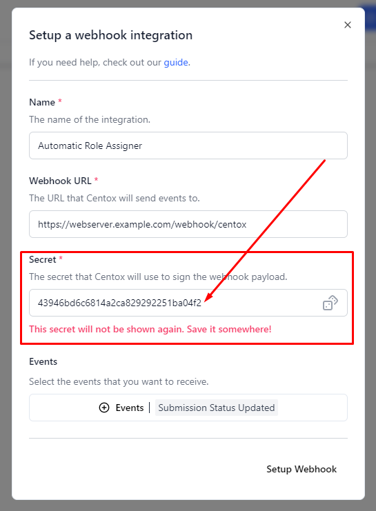

# Verifying request

When creating a Webhook, a unique secret key is generated. This key is used to verify the incoming requests.

When receiving a webhook from Centox the following headers are appended:

`` X-Centox-Webhook-Secret: `The secret of the webhook` ``

`` X-Centox-Webhook-Identifier: `The name of the webhook` ``

`` X-Centox-Webhook-Timestamp: `UNIX timestamp (millis) of when the Webhook was sent.` ``
