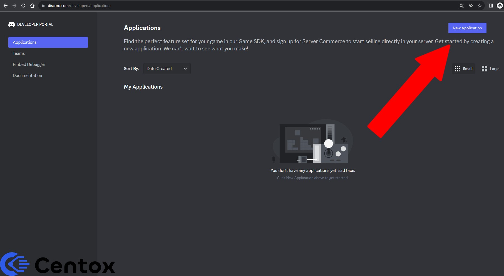
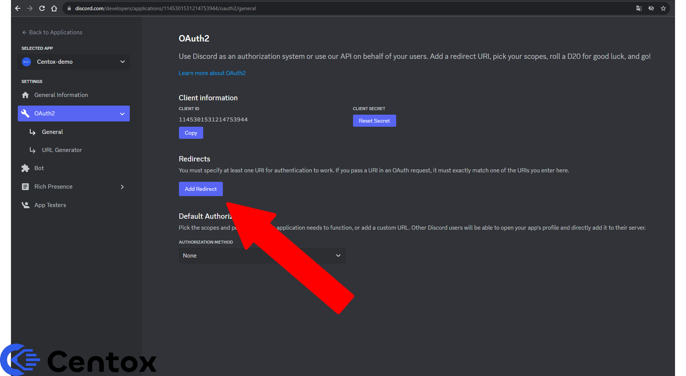

# Discord

<mark style="color:blue;">Step 1:</mark> Create a Discord Application

To start, create a **Discord bot**. \
This is done through this link: [https://discord.com/developers/applications](https://discord.com/developers/applications)

Give your discord-bot a appropriate name & and add a logo.

Follow <mark style="color:blue;">**Step 2**</mark> - for adding a correct **url-redirict** link for your application.&#x20;

<mark style="color:blue;">Step 2:</mark> Add an url-redirect for your application

The next step is to add a **url link** to the bot a user goes to after they have **logged in.** \
This is a necessary step for your **Discord bot** to work.

Click <mark style="background-color:blue;">**"Add redirect"**</mark> under the category <mark style="background-color:blue;">**"OAuth2"**</mark>

### What link should be inserted?

Here you need to **insert** the following link:\
`https://<yoururl>.centox.io/api/auth/login/discord/callback`

Be sure to click <mark style="background-color:red;">**"Save Changes"**</mark> at the bottom.

### An example where the name of your forum is "<mark style="color:blue;">demo</mark>"

If the link to your forum is <mark style="color:orange;">**demo.centox.io**</mark>, insert the following link:\
`https://demo.centox.io/api/auth/login/discord/callback`

Follow <mark style="color:blue;">**Step 3**</mark> - on how to insert your Discord bot information into Centox.

<mark style="color:blue;">Step 3:</mark> Insert the Discord bot credentials into your Centox project

The next **step** is to copy information from your **Discord bot** into your project on <mark style="color:blue;">Centox.</mark>

<mark style="color:blue;">Step 4:</mark> Check if you can log in via Discord on your forum

